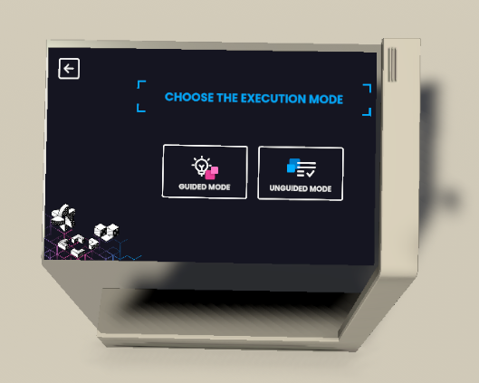

# Execution Mode Selection Step

This step allows the user to choose whether they want to execute the process in `Guided` or `Unguided` mode.

> [!NOTE]
> In `Guided` mode the help screen will be shown
>
> The screen that allows to choose the execution mode is already added to the template scene in the `Interactive Panel` prefab.

