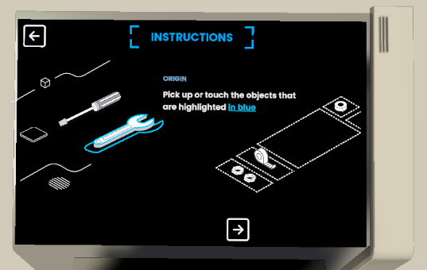
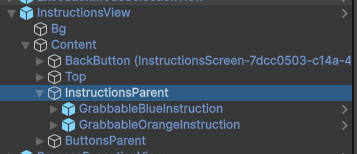
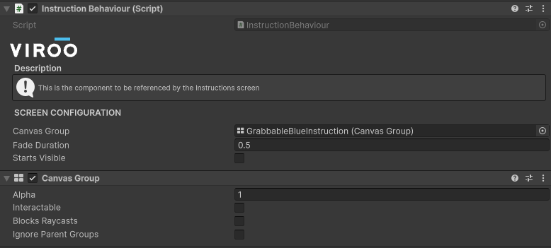
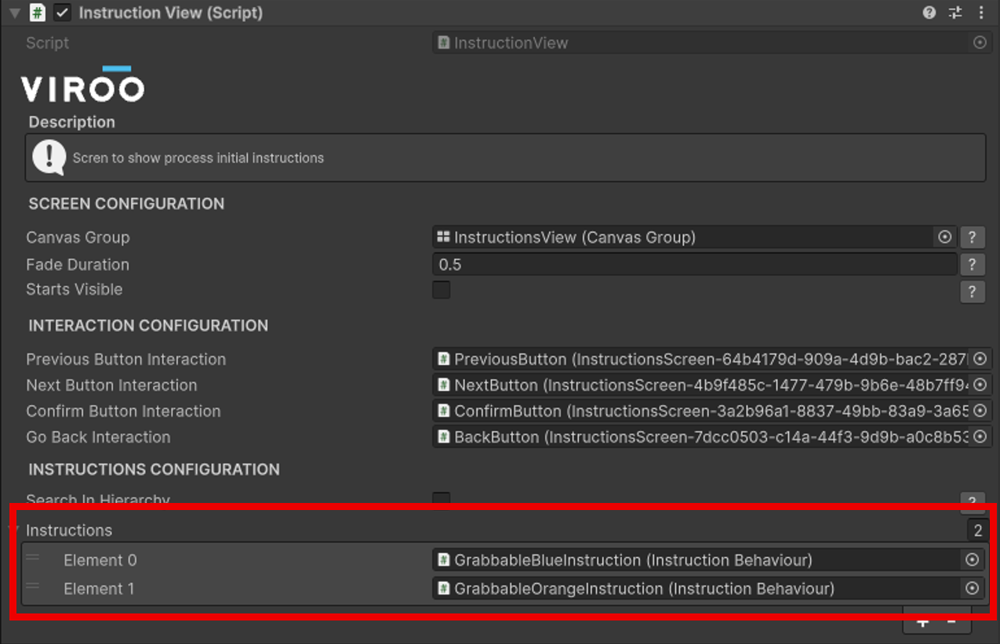

# Instructions Step

This step will show the user a series of screens to explain some process logic.

> [!NOTE]
>
> The screen that allows to show the instructions is already added to the template scene in the `Interactive Panel` prefab.

> [!WARNING]
> This step will only be executed in the execution `Guided` mode.
>

By default two instructions are configured explaining how the grab and place step shows the objects that must be interacted.

You can create your own instructions by creating a new child in the `InstructionsView` gameobject and adding it to the instruction list:

