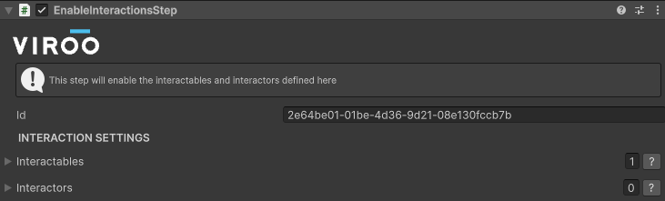
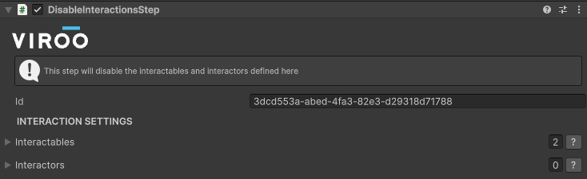

# Interactions Step

These steps will modify the interactions in the scene.

## Enable Interactions Step

This step will enable the interactables and interactors assigned to their corresponding field lists.

## Disable Interactions Step

This step will disable the interactables and interactors assigned to their corresponding field lists.

