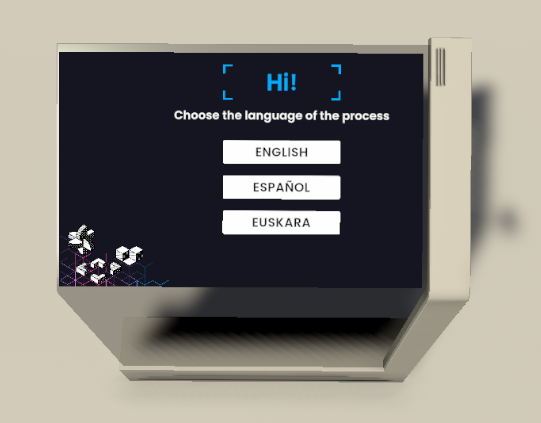

# Language Selection Step

This step allows the user to choose the language they want the process to be in.

The selectable languages are obtained from the [scene configuration](https://virooportal.virtualwareco.com/docs/3.0/viroo-studio/Environment-Customization/Localization/Setting-Localization.html) component.

> [!NOTE]
>
> The screen that allows to choose the language is already added to the template scene in the `Interactive Panel` prefab.

