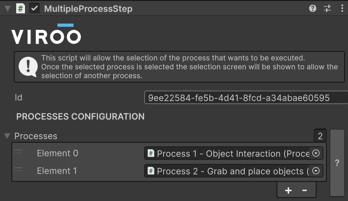
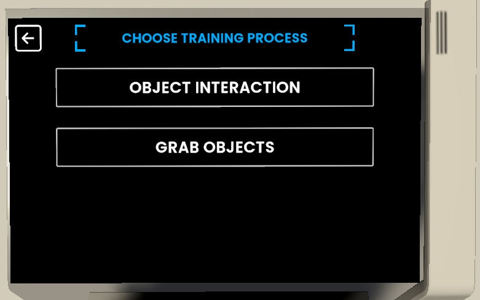

# Multiple Process Step

This component will allow a training module to have more than one [Process Step](ProcessStep.md). Each process will be timed independently and the results of each process will be shown at the end of each one of them.

To configure more than one process add them to the `Processes` list field:

To select which process to execute this will be done in the interactive panel of the scene.

