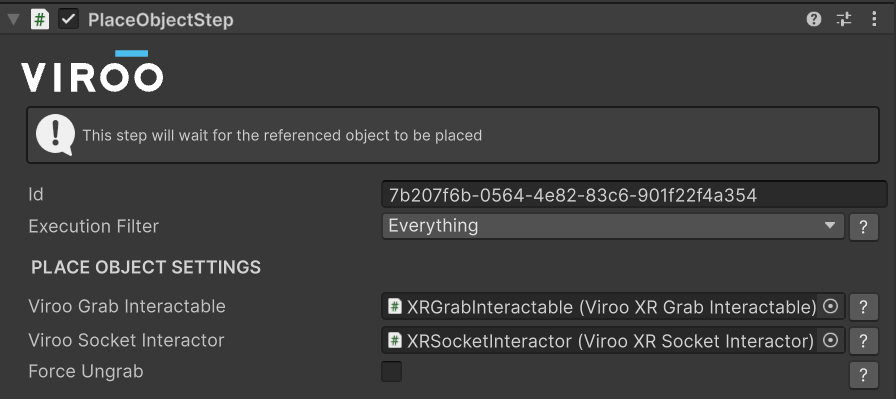
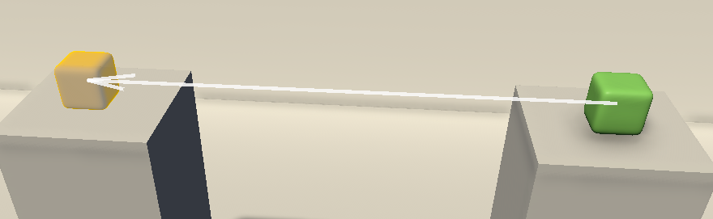
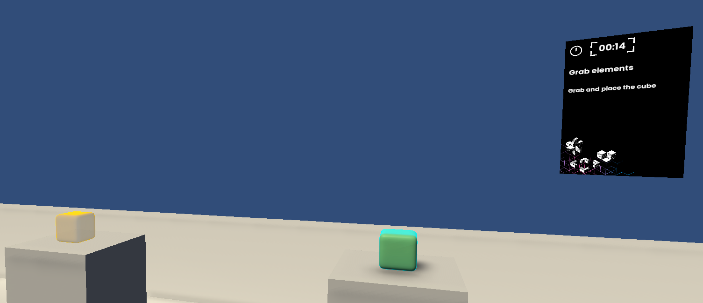
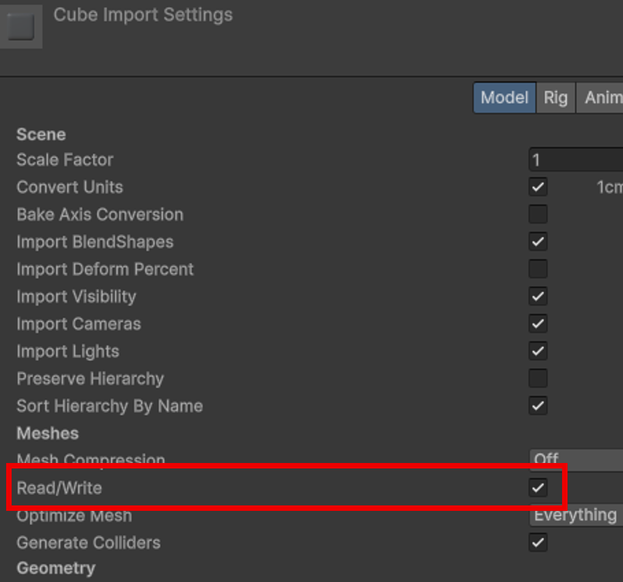

# Place Object Step

> [!NOTE]
> Refer to the Viroo documentation to expand the information on the [Grab Interaction](https://virooportal.virtualwareco.com/docs/3.0/viroo-studio/Interaction-System/Interactions/Grab-Interaction.html) and [Socket Interaction](https://virooportal.virtualwareco.com/docs/3.0/viroo-studio/Interaction-System/Interactions/Socket-Interaction.html)

This step will simplify the "Grab this object and place it in another position" logic.

The object in the scene that will be grabbed must have a VirooXRGrabInteractable component, and the target position a VirooXrSocketInteractor component.

> [!WARNING]
> These Viroo components should have its persistence set to `None`.

In editor mode a visual feedback will be given to show the developer the origin and target position (in the following image and arrow is shown to visualize this, the orange cube is just a visual representation).

If the execution is `Guided` an orange hover visualization will be shown to the user, also a blue rim will be shown in the object that must be grabbed.

> [!IMPORTANT]
> In order for the package to be able to render a orange hover version of the child models of the VirooXRGrabInteractable their meshes must have the Read/Write check enabled.
> 
