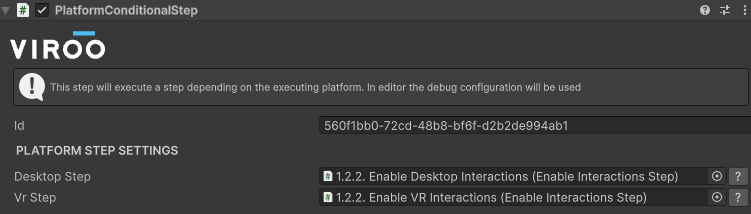

# Platform Conditional Step

This step will allow to execute different logics depending on the current platform.

This can be useful for example if a set of interactions must be activated in Desktop mode and another set of interactions in VR mode.

> [!CAUTION]
> In a session users in both Desktop and VR can be connected at the same, do not create two complex process each one for one specific platform
> as this will create discrepancies in the shared execution.
