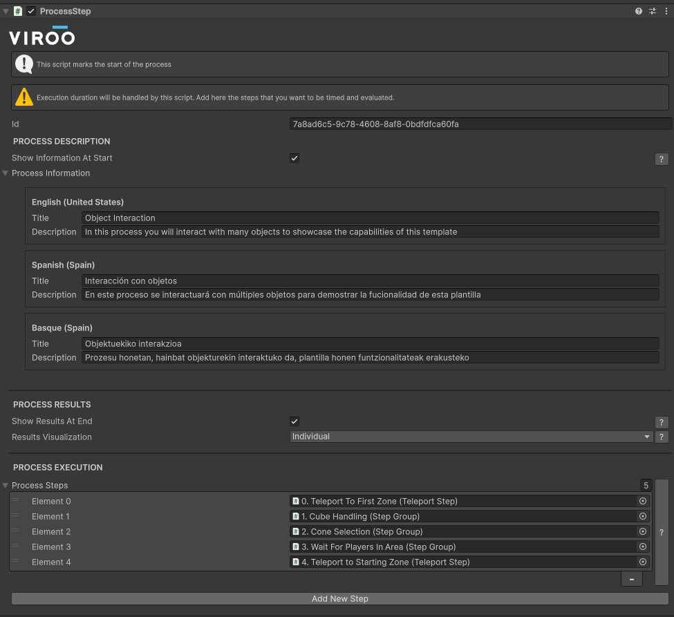
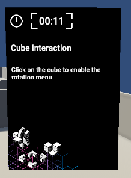
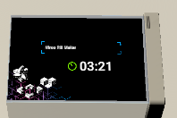
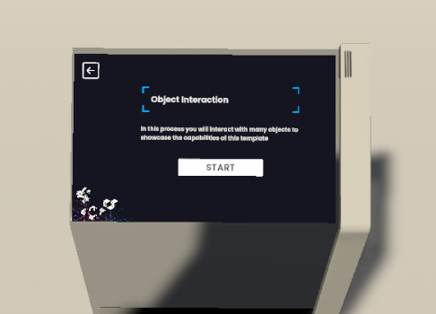
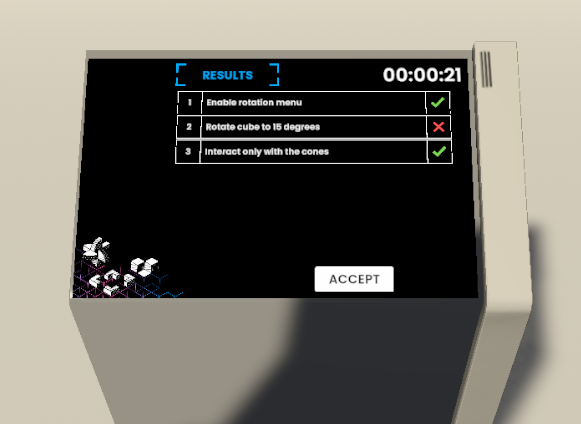

# Process Step

The `Process Step` component is very similar to a [Step Group](./StepGroup.md), it will have a list of steps that will allow to configure the process sequence.

In this component the training module's title and description will be defined for each scene localization.

Unlike the Step Group this component will also handle the **process execution time**, when the process execution reaches this component a timer will be started to handle the time it takes to the users to complete the process, this timer will stop once all of the steps assigned to the Process Step's *Steps* serialize field:

The process current duration time can be seen in the instructions screen and in the process execution screen in the panel.

|      |       |
| :-------------: | :-------------: |
|  |  |

## Lifecycle

A `ProcessStep`'s lifecycle could be resumed in the following phases:

### 1. Show process information

At the start of a process it can be decided too show its information or not, this will result in the scene panel showing the title and description of the process:

### 2. Execute the assigned steps

In this phase the process steps will be executed in sequence.

### 3. Show the results

At the end of a process its results can be shown in the following screen:

