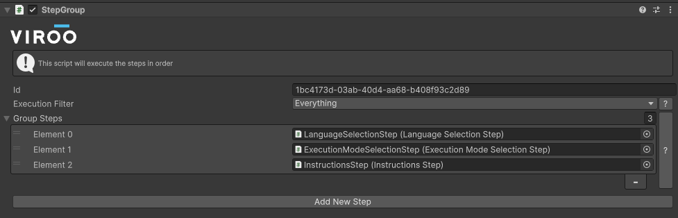

# Step Group

The `Step Group` component allows to have a list of steps to make it easier to group parts of a process, the steps listed in the `Steps` serialized field are the ones that will be executed in a sequential order.

For example the introduction part of a process could have the configuration steps as shown below:

This setup will result in the following sequential execution:

LanguageSelectionStep → ExecutionModeSelectionStep → InstructionStep
