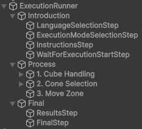
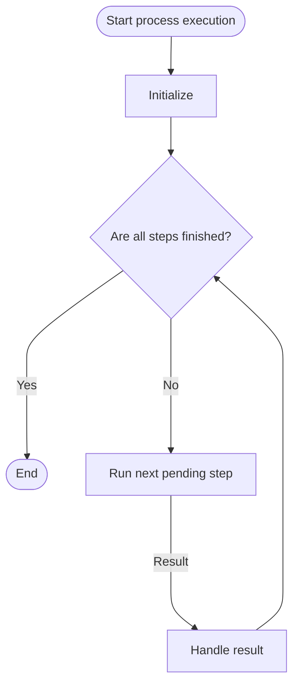

# Step Runner

The `Step Runner` component is the one in charge of configuring and starting the process once the scene loads.

The training process will be configured by adding and nesting steps to the `Execution Steps` field:

## Process lifecycle

The Step Runner will run each step in a sequential order. If the step is a [StepGroup](../Components/StepGroup.md) or a [ProcessStep](../Components/ProcessStep.md) all of its child steps will be executed before marking it as `Completed`. In this way you can nest single steps and group steps to adequate to each process needs.

The process lifecycle will look like the following diagram:

