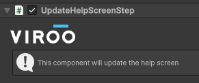
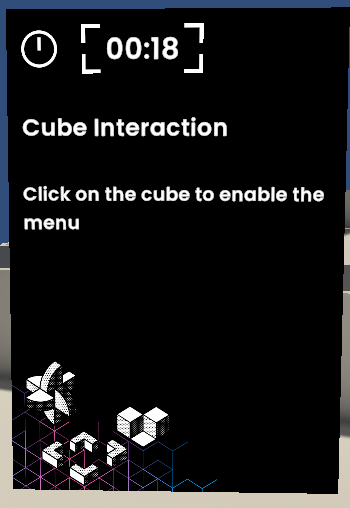
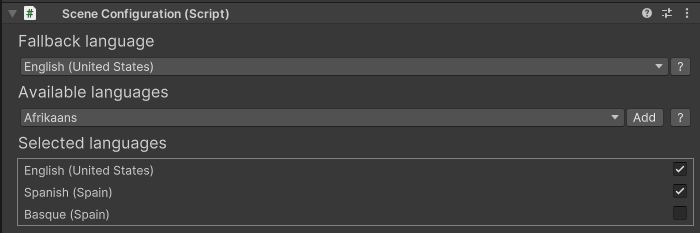
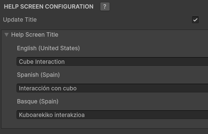
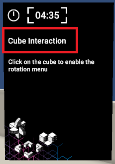
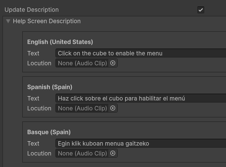
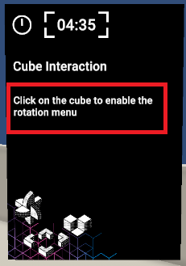
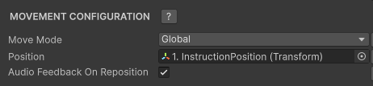

# Update Help Screen Step

To help the user during the process you can update the information in the floating help screen, this can be achieved using the `UpdateHelpScreenStep`.

> [!NOTE]
> Keep in mind that texts must be provided for each localization selected in the [SceneConfiguration](https://virooportal.virtualwareco.com/docs/3.0/viroo-studio/Environment-Customization/Localization/Setting-Localization.html) component.
> 

## Update Title

To update the screen title you can do it by enabling the `Update Title` section of the component, here you can configure the desired title in each localization configured in the `SceneConfiguration` component.

This component allows you to change the title of the help screen:

## Update Description

To update the screen title you can do it by enabling the `Update Description` section of the component, here you can configure the desired description for each localization.

A locution can also be added to each text in order to play an auditive feedback when updating this information.

## Move Help Screen

The help screen can be moved to desired position throughout the scene. Here you can configure the following:

- The position in the scene to move to.
- If the help screen will move to the assigned position in `Local` or `Global` mode.
- Whether to play an auditory feedback when moving the screen (this will only be played if the description does not have a locution).

