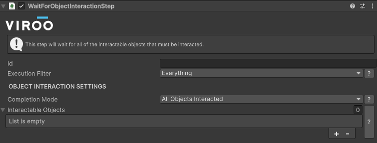
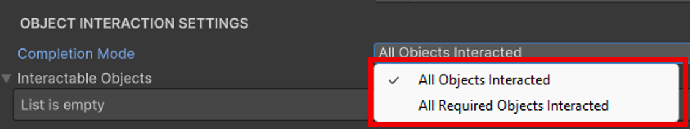
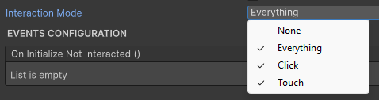

# Wait For Object Interaction Step

This step will allow to configure a list of objects that will need to be interacted with and will wait for the user to interact with them.

> [!NOTE]
> An example of this can be found in the [VirooExerciseBuilderLab](.docs/Documentation/Samples/VirooExerciseBuilderLab.md) sample scene.

This step can be completed in different ways:

- **All Objects Interacted:** all of the referenced objects are interacted.
- **All Required Objects Interacted:** all of the interactable objects that have `Must Be Interacted` field checked are interacted.

## Configure An Interactable Object

Add the `Interactable Object` component to the object that must be interacted with.
This script requires to have an XRSimpleInteractable to detect the user interaction with the object

> [!WARNING]
> A collider is not added by default, do not forget to add it to the XRSimpleInteractable.

| **Configuration**  |                                                                                                                                                                                                                                                              |
| ------------------ | ------------------------------------------------------------------------------------------------------------------------------------------------------------------------------------------------------------------------------------------------------------ |
| **Fiield**         | **Description**                                                                                                                                                                                                                                              |
| Must Be Interacted | Defines if the interaction with the object is required (this is used to determine the step completion)                                                                                                                                                       |
| Interaction Mode   | Whether to subscribe to the _Select_ or _Activate_ events of the XRSimpleInteractable (this can be used to configure interactions in Desktop and VR mode)  |

