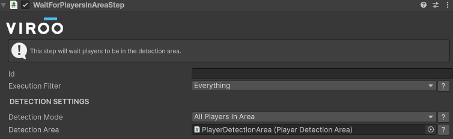
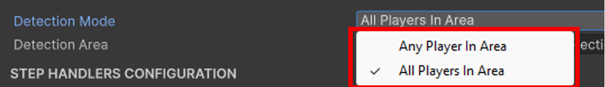
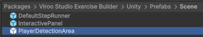
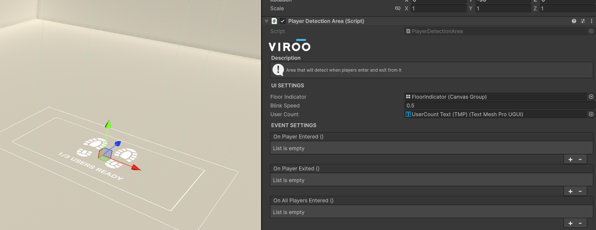

# Wait For Player Detection Step

This step will wait for all connected users to move to a determined area.
This can be useful to define "safe areas" before teleporting users to another area.

This step can be configured to wait for all the players to be in the area or any of them.

## Create a Player Detection Area

To add a player detection area to the scene you can do it by adding the `PlayerDetectionArea` prefab.

This prefab will show a footprints icon on the floor to indicate users where they must move to.

