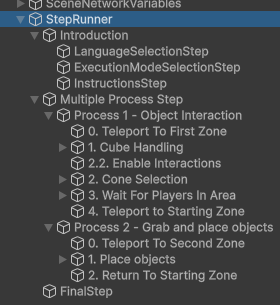
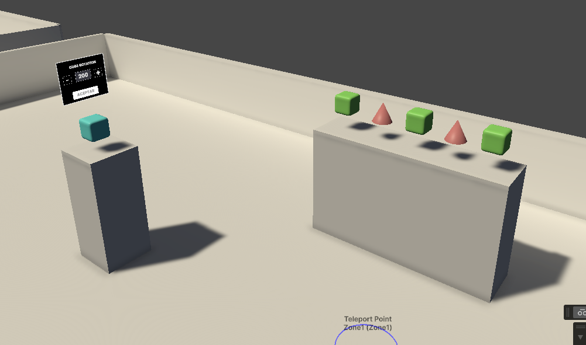
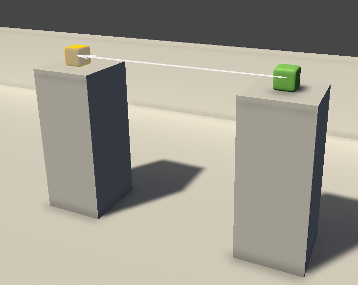

# Viroo Exercise Builder Lab

This scene has an example of a training module with two processes.

Each process will teleport the users to a specific area in the scene and will have different steps to showcase their functionality.

In one of the process differen types of interaction steps are configured.

In another process a grab and place object step is showcased.

