# Viroo Exercise Builder

## Table of contents

- [Prerequisites](#prerequisites)
- [Samples](#samples)
- [Getting Started](#getting-started)
- [Process Execution](#process-execution)
  - [Key components](#key-components)
  - [Execution modes](#execution-modes)
  - [Step lifecycle](#step-lifecycle)
  - [Execution order](#execution-order)
  - [Process duration](#process-duration)
- [Process Persistence](#process-persistence)
- [Networking](#networking)
  - [Float Scene Network Variable](#float-scene-network-variable)
  - [Bool Scene Network Variable](#bool-scene-network-variable)
- [Process Customization](#process-customization)
- [Process step customization](#process-step-customization)
  - [Step Events](#step-events)
  - [Step Evaluations](#step-evaluations)
- [Utilities](#utilities)
  - [Conditional Unity Events](#conditional-unity-events)

## Prerequisites

Install [Visual Studio Code](https://code.visualstudio.com/) to correctly visualize this documentation

Install [Markdown Preview Mermaid Support](https://marketplace.visualstudio.com/items?itemName=bierner.markdown-mermaid) VSCode extension to correctly visualize diagrams in this documentation.

Install [Markdown Alert](https://marketplace.visualstudio.com/items?itemName=kejun.markdown-alert) VSCode extension to correctly visualize alerts.

## Samples

[Viroo Pill Maker Lab](.docs/Documentation/Samples/VirooExerciseBuilderLab.md) is a sample scene where many of the features of this package are shown.

`Viroo Pill Maker Template` is a template scene where an initial process is already configured and can be used as the starting point for a training module creation.

## Getting Started

In the [VIROO Main Scene](https://virooportal.virtualwareco.com/docs/3.0/viroo-studio/Creating-with-VIROO-Studio/Creating-a-VIROO-Application.html) the `VirooExerciseBuilder` prefab must be added.


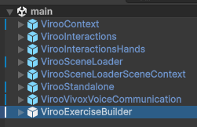

## Process Execution

### Key components

To create a sequential training module there are some key components that will be used:

- [Step Runner](.docs/Documentation/Process/Components/StepRunner.md): component responsible of starting the process execution.
- [Step Group](.docs/Documentation/Process/Components/StepGroup.md): group of executable components that will be executed in order.
- [Process Step](.docs/Documentation/Process/Components/ProcessStep.md): similar to the `Step Group`, it will also manage the process duration time.
- [Steps](#process-customization): components that will allow different behaviours such as waiting for a user interaction, waiting for the users to be in a specific area...

### Execution modes

The execution process can be configured in two modes:

- **Guided:** process instructions will be shown and element model hover feedback will be shown.
- **Unguided:** nor instructions nor model hover feedback will be **not** shown.

The execution mode can be configured in two ways:

- In the [StepRunner](.docs/Documentation/Process/Components/StepRunner.md) `Execution Mode` field:

  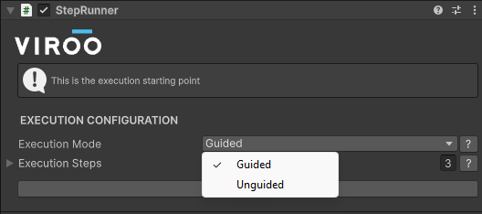

- Using the [ExecutionModeSelectionStep](.docs/Documentation/Process/Components/ExecutionModeSelectionStep.md)

Process steps can be configured to be executed in one of these modes or in both using the `ExecutionFilter` field:

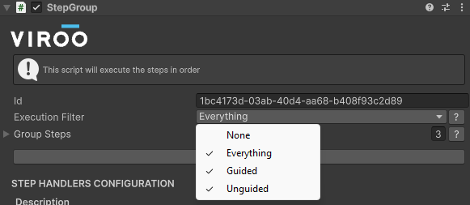

### Step lifecycle

The components used to configure the process behave in different ways depending on the user session presence.

- If the user is present when the step begins this will run normally.
- If the user connects while doing a step this step's state will be restored.
- If the user connects after a step has been completed this step will be skipped and set to its final state.

> [!NOTE]
> Other components will react and behave in different ways depending of the current step state.
>
> For example the `Restore` event of the [event handler](#events) will only be triggered by the step that is currently being executed when a user connects.
>
> Restoring a step allows the developer to restore the scene to the state it should be mid step execution.
>
> Skipping it will allow the developer to set the scene state to how it should be at the end of that step.
>
> E.g.: The _Close the door_ step if skipped should close the door instantly

The following flow chart visualizes how the lifecycle of a step does behave depending of the current network state of the process:

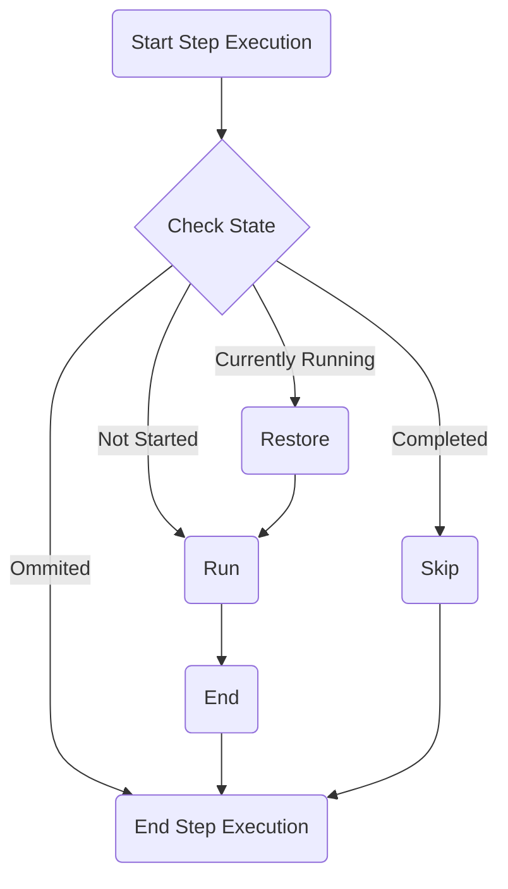

### Execution order

The `StepRunner` component will start the process in the sequential order defined in its `Execution Steps` serialized field.

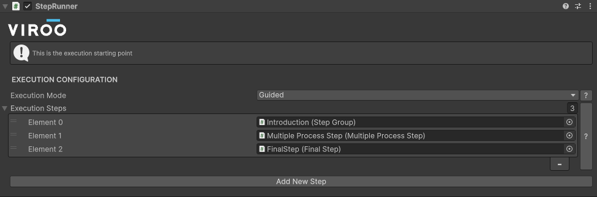

If the current process component has a list of steps ([Step Group](.docs/Documentation/Process/Components/StepGroup.md) or [Process Step](.docs/Documentation/Process/Components/ProcessStep.md)) the execution will follow sequentially going through the nested steps.

For example if the presented process is executed:

```csharp
Execution (ExecutionRunner)
   │
   ├── 1.Group (StepGroup)
   │       └── 1.1.Step (Step)
   │
   ├── 2.Group (ProcessStep)
   │       ├── 2.1.Step (Step)
   │       └── 2.2.Step (Step)
   │
   └── 3.ResultsStep (Step)

```

The components will be executed in the following order:

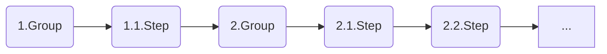

This execution will be stored in the server allowing to users that connect later to restore the process to its current state. For example if **User1** starts the process and completes the first two steps, its execution process will look like this:

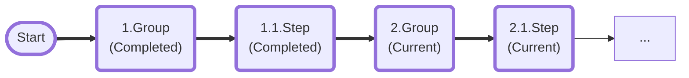

Now when the **User2** connects to the session it will restore the process by skipping the first two steps and restoring the third step's state:

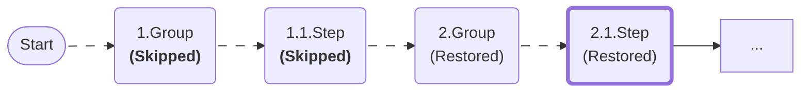

### Process duration

Process duration is handled by the [Process Step](.docs/Documentation/Process/Components/ProcessStep.md) component.

## Process persistence

> [!CAUTION]
> VIROO provides tools to achieve this goal. The proper restoration of the simulation lies in the hands of the person who creates the content.

> [!NOTE]
> For persistence general information please refer to the [Viroo Studio Documentation](https://virooportal.virtualwareco.com/docs/3.0/viroo-studio/Networking/Persistence.html)

To handle the persistence of a sequential process a few considerations must be taken.

Persistence type of Viroo components is advised to be set to `None`:

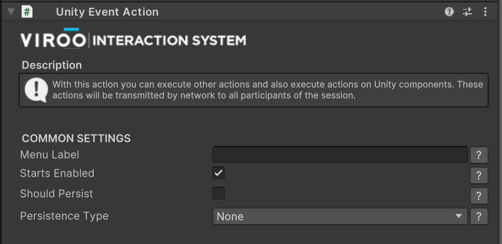

## Networking

> [!NOTE]
> For general information regarding Viroo networking please refer to the [Viroo Studio Documentation](https://virooportal.virtualwareco.com/docs/3.0/viroo-studio/Networking/Overview.html)

### Scene Network Variables

This packages introduces a simplified access of [Network Variables](https://virooportal.virtualwareco.com/docs/3.0/viroo-studio/Networking/Synchronizing-Data-and-Logic/Network-Variables.html)
in the scene.

> [!WARNING]
> Keep in mind that these are a limited set of components tailored to the most common use cases, maybe not all of the types are taken into account.

For now the following scene network variables can be created:

- Float Scene Network Variable
- Bool Scene Network Variable

#### Float Scene Network Variable

This variable can be created using the `FloatSceneNetworkVariable` component.

This component will create a `float` Network Variable and will expose methods to update its value such as: _Add_, _Subtract_ or _SetValue_.

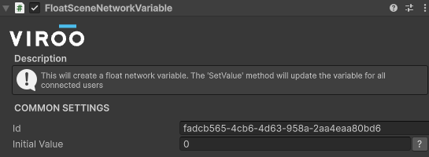

To update this variable values you can call the exposed methods from a UnityEvent.

Another way of updating the value of it is using the `VariableChangeMenu` prefab:

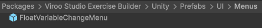

By default this menu will be hidden, but it can be shown by calling the _Show_ method from a UnityEvent.

This screen will allow to increase or decrease the value of a float variable
(an example of this can be found in the [VirooExerciseBuilderLab](.docs/Documentation/Samples/VirooExerciseBuilderLab.md) sample scene)

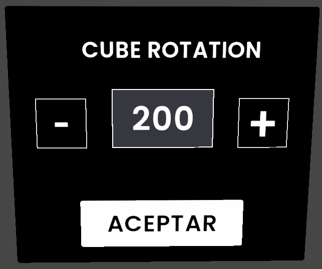

There are also two components to react to the value changes of this variable.
The `FloatVariableRotationReactionBehaviour` will rotate an object depending on the value of the variable:

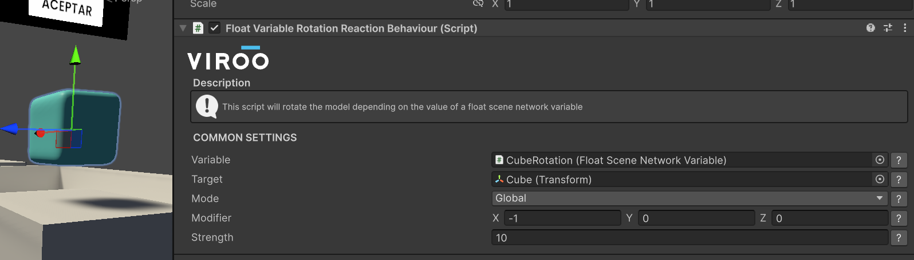

The `FloatVariableTextReactionBehaviour` component will update a text value depending on the variable value:

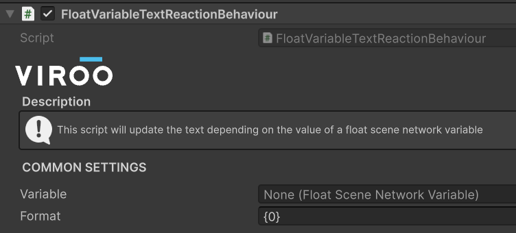

### Bool Scene Network Variable

This scene variable can be created using the `BoolSceneNetworkVariable` component.

This variable will store a boolean value and its value can be updated using the _SetValue_ exposed method.

Additionally a set of UnityEvents will be exposed to execute logic when the variable initializes or changes its value.

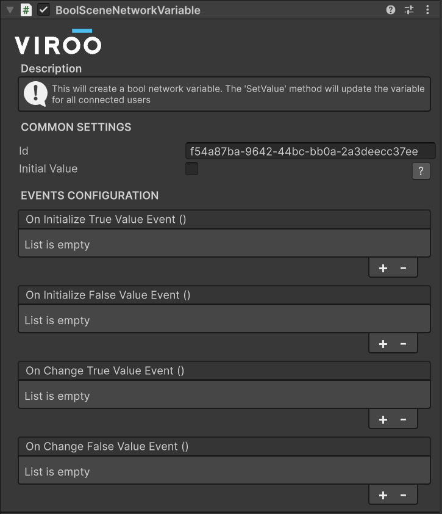

## Process Customization

In order to create the sequential process there are already existing step implementations to cover some common use cases.

These are the available steps:

- [Execution Mode Selection Step](.docs/Documentation/Process/Components/ExecutionModeSelectionStep.md)
- [Final Step](.docs/Documentation/Process/Components/FinalStep.md)
- [Instructions Step](.docs/Documentation/Process/Components/InstructionsStep.md)
- Interaction Steps:
  - [Enable Interactions Step](.docs/Documentation/Process/Components/InteractionsStep#enable-interactions-step.md)
  - [Disable Interactions Step](.docs/Documentation/Process/Components/InteractionsStep#disable-interactions-step.md)
- [Language Selection Step](.docs/Documentation/Process/Components/LanguageSelectionStep.md)
- [Multiple Process Step](.docs/Documentation/Process/Components/MultipleProcessStep.md)
- [Place Object Step](.docs/Documentation/Process/Components/PlaceObjectStep.md)
- [Platform Conditional Step](.docs/Documentation/Process/Components/PlatformConditionalStep.md)
- [Process Step](.docs/Documentation/Process/Components/ProcessStep.md)
- [Step Group](.docs/Documentation/Process/Components/StepGroup.md)
- [Teleport Step](.docs/Documentation/Process/Components/TeleportStep.md)
- [Update Help Screen Step](.docs/Documentation/Process/Components/UpdateHelpScreenStep.md)
- [Wait For Object Interaction Step](.docs/Documentation/Process/Components/WaitForObjectInteractionStep.md)
- [Wait For Players In Area Step](.docs/Documentation/Process/Components/WaitForPlayersInAreaStep.md)
- [Wait For Trigger Step](.docs/Documentation/Process/Components/WaitForTriggerStep.md)

These steps can be added in multiple ways, from the _Add Component Menu_ under Viroo → Studio → Exercise Builder → Step:

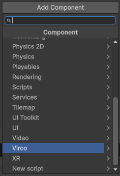
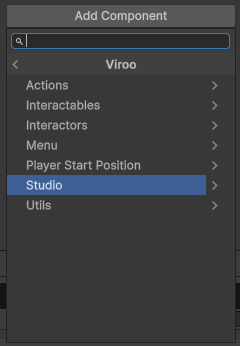
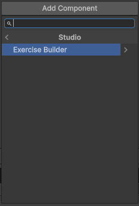

Or using the buttons in the `Step Runner`, `Process Step` and `Step Group` components:


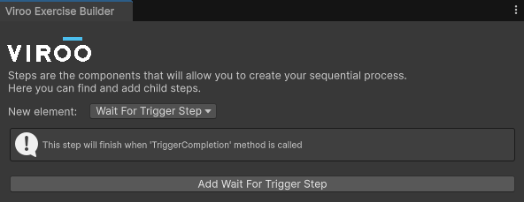

## Process step customization

Some of the previous mentioned steps can have their functionality extended, you can identify them because they have a `STEP HANDLERS CONFIGURATION` section in their inspectors:

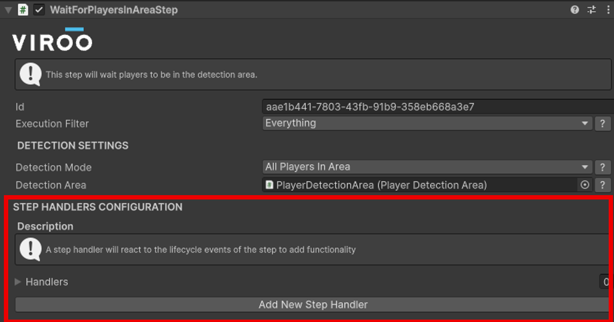

In this context a **handler** is a component that can extend a step's functionality.

Amongst them you can find handlers to add evaluation logic to the step or add custom events.

You can add these components by using the "Add New Step Handler" button in the inspector or by using the `Add Component Menu` under

> Viroo → Studio → Exercise Builder → Handlers

> [!IMPORTANT]
> In order for a handler to be executed it must be referenced in the `Handlers` list of a step.

### Step Events

As mentioned in the [component lifecycle](#step-lifecycle) section, a process component behaves in different ways depending of the network state of the execution.

To be able to react to this lifecycle the `Events Handler` component can be used.

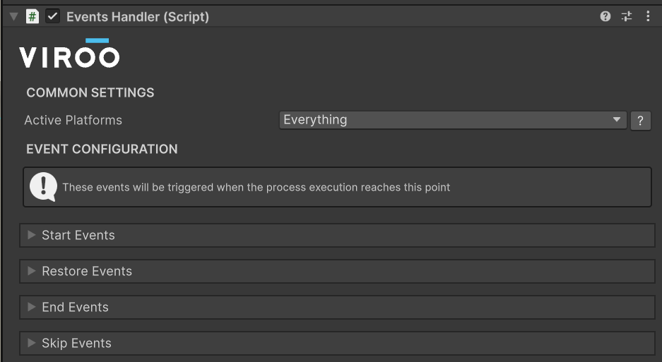

This component will expose a series of events that will be triggered in the different times of the process component.

| **Events**     |                                                                                                                                                                                                                                                   |
| -------------- | ------------------------------------------------------------------------------------------------------------------------------------------------------------------------------------------------------------------------------------------------- |
| **Event**      | **Description**                                                                                                                                                                                                                                   |
| Start events   | These events are invoked at the beginning of the step, only for the currently connected users. Normally used for initializing the elements that are going to be interacted with.                                                                  |
| Restore events | These events are invoked if a user connects when a step is currently being executed.                                                                                                                                                              |
| End events     | These events are invoked for the users that are connected when a step is completed.                                                                                                                                                               |
| Skip events    | These events are invoked if a user connects and a step is already completed. They are normally used to leave the scene in the final state as if the step had been executed normally (e.g. leaving a door closed after the _Close the door_ step). |

Each set of events exposes four `UnityEvent` to allow more customization:

- **On EVENT:** this is the base event that will trigger as defined before.
- **On Leader User EVENT:** This is only invoked by the leader user in the session. This allows for example to trigger networked actions by only one person.
- **On EVENT Guided:** Invoked only in `Guided` execution mode.
- **On EVENT Unguided:** Invoked only in `Unguided` execution mode.

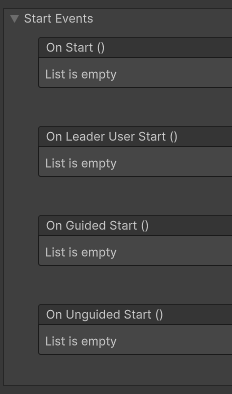

### Step Evaluations

In order to create a set of results of the training module the following steps must be followed.

Let's say that we have this process hierarchy:

```txt
1. Cube interactions
   ├── 1.1. Enable rotation menu
   └── 1.2. Rotate cube to 15 degrees
```

We want to group the steps 1.1 and 1.2 under the "Cube interactions" group.

To create this same hierarchy in the results the following components must be configured.

> [!NOTE]
> This example can be found in the [VirooExerciseBuilderLab](.docs/Documentation/Samples/VirooExerciseBuilderLab.md) sample scene.

#### Group Evaluation Handler

The `GroupEvaluationHandler` component defines the start of a result group

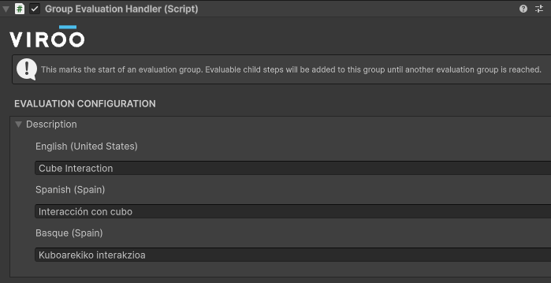

This component should be added to the `1. Cube Interactions` GameObject.

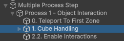


#### Step Evaluation Handler

The `StepEvaluationHandler` component defines how a step is evaluated as well as the localized text that will be shown in the results screens.

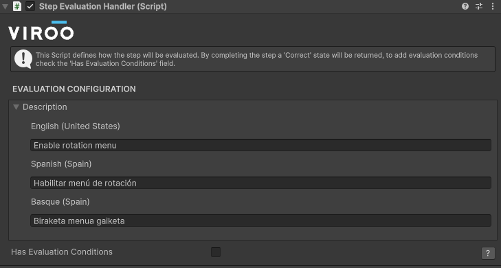

Once a step is completed, it will be evaluated and registered in the training module results if it has a `StepEvaluationHandler` element in its `Handlers` list.
By default by completing the step a `Correct` result is returned, this can be useful if you only want to show a step as part of the process
but an additional condition is not required to evaluate it.

If additional conditions are required this can be configured by checking the `Has Evaluation Conditions` checkbox.
This will enable the following configuration:

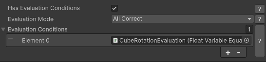

Here you can add to the `Evaluation Conditions` list a series of components that will return a `Correct` or `Incorrect` result
depending on each condition.

You can also decide if all of the evaluation conditions must be correct in order to set a `Correct` state to the step,
or if it is only necessary for one of them to be correct.

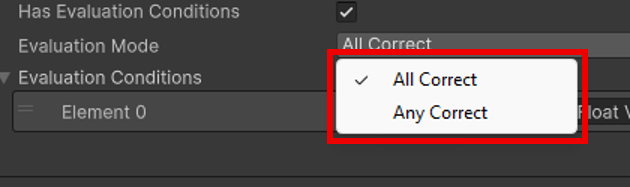

Amongst the evaluation conditions the following can be found:

- **Float Variable Equal Evaluation Condition:** checks if the value of a [Float Scene Network Variable](#float-scene-network-variable) is equal to the defined one.
  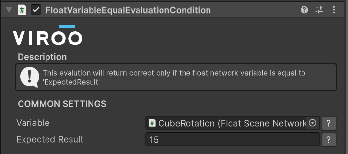
- **Float Variable Range Evaluation Condition:** checks if the value of a [Float Scene Network Variable](#float-scene-network-variable) is in the defined range.
  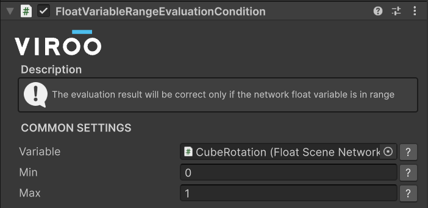
- **Result Setted Evaluation Condition:** this component exposed two methods _SetCorrectResult_ and _SetIncorrectResult_ when this condition is evaluated the set result will be returned.
  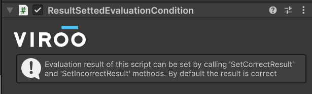

#### Evaluations screen

When the application is executed the training module results are created. These can be visualized in the screen in the left panel.

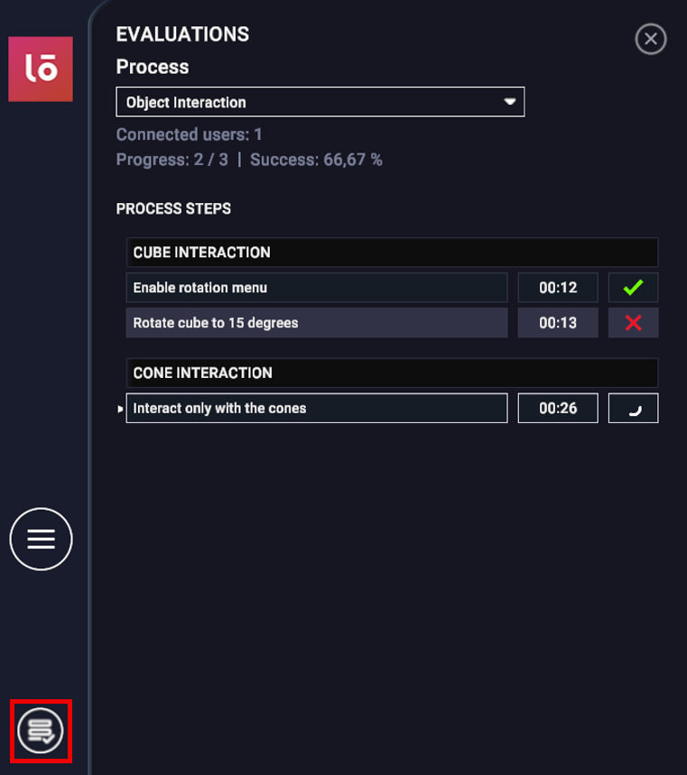

#### Exporting results

The results of the training module can be exported to a .xlsx format,
this export can be created using the `Export Results` button in the evaluation screen.

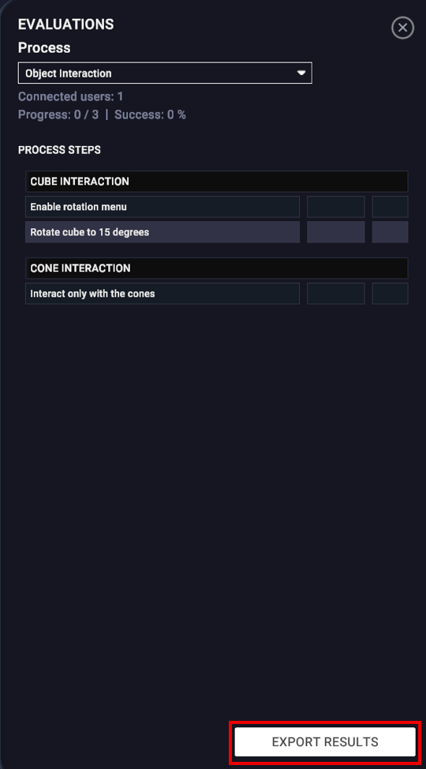

This export can be opened for example in Microsoft Excel.

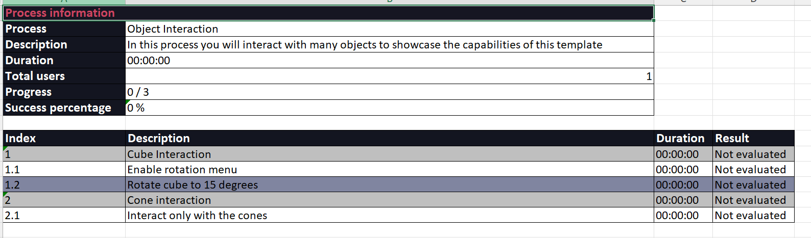

## Utilities

### Conditional Unity Events

There are some components that allow to trigger UnityEvents depending on certain execution conditions:

- **Execution Mode Conditional Unity Event:** component that will trigger the `Guided` or `Unguided` UnityEvent depending on the selected [execution mode](#execution-modes).
  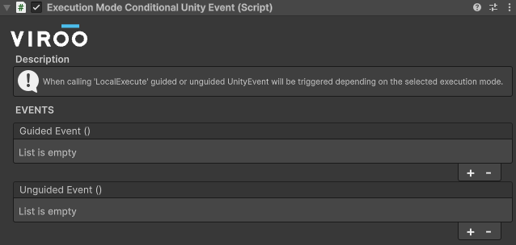

- **Leader User Conditional Unity Event:** component that will trigger only if the client is the leader client.
  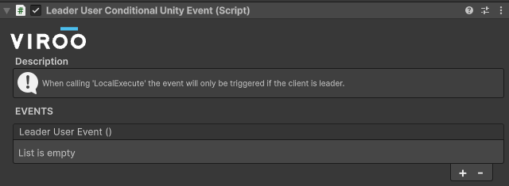
