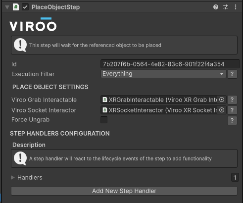

# VIROO Studio Template / Exercise Builder

This template simplifies the process of creating sequential training modules in the context of **VIROO**.

It provides a set of tools based on custom **Unity Editor Windows / Inspectors**, and a collection of components to enable a quick and easier development of networked training modules.

---

## 🚀 How It Works

The main idea is to support the creation of a **"Training Module"** composed of **"Completable Steps"**.  
In the **[Demo]** example scene, you can find an already configured training module that showcases this template's capabilities.

We provide a set of **"Completable Steps"** already implemented, but the system is designed to be **extended** with your own completion systems — which can be implemented in **C#**.

---

## 🧩 Completable Step Types

Those **"Completable Steps"** can be of several types, including among others:

- **Language Selection Step:** Allow the user to select which language they want to execute the training module in a 3D interactive screen.
- **Step Group:** Step the allows the grouping of multiple completable steps.  
- **Teleport Step:** Step that will handle the teleport of all users connected in the session and will allow the graceful persistence restore.  
- **Instruction steps:** Steps to update the instructions given to the user in the **"Instruction Floating Screen"**
- **Grab and place step:** Step to allow the **"Grab and Place"** logic.
- **Wait For Players in Area Step:** Step that allows to wait for any or all user to be in an specific area before continuing with the module.

> [!NOTE]  
> A complete guide and explanation of all of the available steps can be found in the package documentation **`Packages/Viroo Studio Exercise Builder/README.md`**

---

## ⚡ Quick Start

We recommend the following steps to get started quickly:

1. **Run the Demo Scene:**  
   Open **`Assets/Scenes/Demo`** and explore the already created training module.  
2. **Explore the Documentation:**  
   Check out the [**Viroo Exercise Builder** documentation](./Docs/README.md) in the Docs folder.

---

## 🛠️ Training Module Editor

To create, edit, and configure the **Training Module** we provide a set of components that can be tailored from the scene:

  

---

## 💡 Extending the Template

Based on the **"Viroo Exercise Builder"** package, new functionality can be added by implementing the base classes of the package.

If you find something that could improve the template, feel free to **contact us** or submit a **pull request**.

---

## ❤️ We Hope You Enjoy the Template!